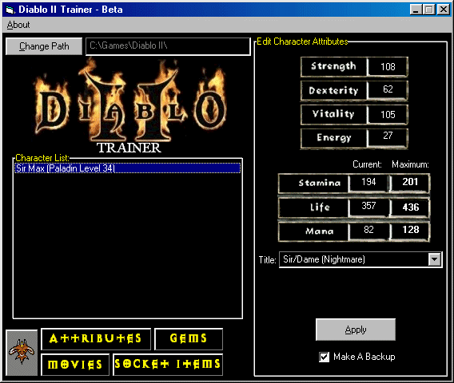



## Diablo II Trainer

### Description

This program can change character's attributes, socket items, convert potions to gems, upgrade gems, enable movies, change character's title and has a kewl interface .. check it out!
 
### More Info
 

             |
---                |---
**Submitted On**   |2000-08-08 23:24:20
**By**             |[Max Raskin](https://github.com/Planet-Source-Code/PSCIndex/blob/master/ByAuthor/max-raskin.md)
**Level**          |Advanced
**User Rating**    |5.0 (10 globes from 2 users)
**Compatibility**  |VB 5\.0, VB 6\.0
**Category**       |[Complete Applications](https://github.com/Planet-Source-Code/PSCIndex/blob/master/ByCategory/complete-applications__1-27.md)
**World**          |[Visual Basic](https://github.com/Planet-Source-Code/PSCIndex/blob/master/ByWorld/visual-basic.md)
**Archive File**   |[CODE\_UPLOAD8759882000\.zip](https://github.com/Planet-Source-Code/max-raskin-diablo-ii-trainer__1-10528/archive/master.zip)

